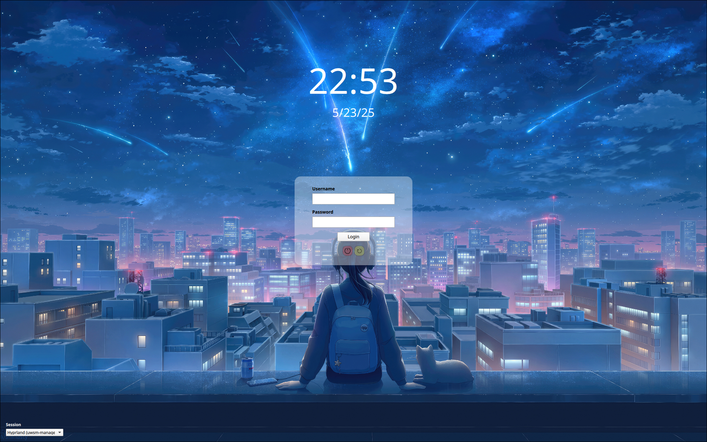

# Stargaze SDDM Theme

A modern and elegant SDDM (Simple Desktop Display Manager) theme with a cosmic aesthetic.



## Description

Stargaze is a sleek and minimalist SDDM theme that provides a beautiful login experience with a starry background and modern UI elements. 

## Features

- 🌌 Beautiful cosmic background
- 🔧 Customizable through configuration file

## Installation

### Manual Installation

1. Clone or download this repository:
   ```bash
   git clone https://github.com/HermanPlay/sddm-stargaze.git
   ```

2. Copy the theme to the SDDM themes directory:
   ```bash
   sudo cp -r sddm-stargaze /usr/share/sddm/themes/stargaze
   ```

3. Edit the SDDM configuration file:
   ```bash
   sudo nano /etc/sddm.conf
   ```

4. Set the theme in the `[Theme]` section:
   ```ini
   [Theme]
   Current=stargaze
   ```

5. Restart SDDM or reboot your system:
   ```bash
   sudo systemctl restart sddm
   ```

### Package Manager Installation

*Package manager installations may be available in the future.*

## Configuration

The theme can be customized by editing the `theme.conf` file:

```ini
[General]
background="./assets/background.jpeg"    # Background image path
powerIcon="./assets/power-on.png"        # Power button icon
rebootIcon="./assets/refresh-arrow.png"  # Reboot button icon
```

### Customization Options

- **Background**: Replace `assets/background.jpeg` with your preferred background image
- **Icons**: Customize power and reboot icons by replacing the respective PNG files
- **Colors**: Modify color schemes in the `Main.qml` file
- **Layout**: Adjust positioning and sizing in the QML components

## Requirements

- SDDM 0.21.0 (I have not tested for other versions)
- Qt 6.9 or later
- QtQuick 6.9 or later


## Troubleshooting

### SDDM not starting
- Ensure that your daemon is starting `sddm-greeter-qt6`:
```bash
sudo mv /usr/bin/sddm-greeter /usr/bin/sddm-greeter.qt5.bak
sudo ln -s /usr/bin/sddm-greeter-qt6 /usr/bin/sddm-greeter
```


### Theme not appearing
- Ensure SDDM is installed and running
- Check that the theme path is correct in `/etc/sddm.conf`
- Verify file permissions are set correctly

### Display issues
- Check if all required Qt modules are installed
- Ensure your system supports the required Qt version
- Try restarting the SDDM service

### Custom background not showing
- Verify the image file exists in the assets directory
- Check the file format is supported (JPEG, PNG)
- Ensure the path in `theme.conf` is correct

## Contributing

Contributions are welcome! Please feel free to submit issues, feature requests, or pull requests.

1. Fork the repository
2. Create a feature branch (`git checkout -b feature/amazing-feature`)
3. Commit your changes (`git commit -m 'Add some amazing feature'`)
4. Push to the branch (`git push origin feature/amazing-feature`)
5. Open a Pull Request

## License

This project is licensed under the MIT License - see the [LICENSE](LICENSE) file for details.
---

*Made with ❤️ for the Linux community*